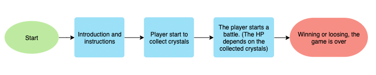
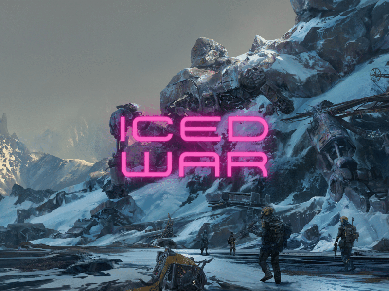

# Concept

This is a single-player RPG game. This game has a little story, therefore it has a beggining and a end. 

The battle is turn-based. The Enemies are two mutant plants. As the main character is a robot, the player will "operate" two parts of it. the "Robot cannions" and the "Robot fists". The robot cannions have more power and healt points capabillity than the fists. But at the end, it all depends on "the crystals" 

The game has a score count. There are crystals on the map that the player can collet. This crystals, not only increase the score, but it will be the healt poits That the player will have for the battle.

As this is more close to a mini game, it has only one "final" battle. and once that the player start it, there is no way back. Winning or loosing, the game is over.

 

 

# Story

It is the year 2853. The world of has been facing in a fourth world war. But this time feels different. There are not many humans left of the billions that there were long ago.

There are only two factions fighting, and one of them almost disappears. Everybody says that the war is about to end. Fortunately, you belong to the team that is about to win.

The camp has been quiet since the war started. Giant robots make anyone feel intimidated. The troops sensed that something serious was about to happen. Unfortunately, they were right.

Cries for help are heard on the communication radio. "We are in the barracks!" was heard before the transmission stopped. But there was something else, a strange sound that you had not heard before.

 

 

# External resources

In order to handle the score data, This project uses [this API](https://www.notion.so/Leaderboard-API-service-24c0c3c116974ac49488d4eb0267ade3). Which was created for this capstone project.

 
 

# Commands

**On the map**
 
- Arrow up.
- Arrow left.
- Arrow rigth.
- Arrow down.
 

**On the battle**

Select enemy:
- Arrow up.
- Arrow down.

Change action:
- Arrow left or space bar.

 

# Game Structure

The game starts with the **Preload Scene**, which loads all assets. After loading, the scene changes to the title scene. 

The **Title Scene** will show a form to store the user's name, then the PLAY button will appear.

Afther the Play button is clicked, the **Introduction Scene** will show a little introduction.

Clicking on next, the **Instructions Scene** will appear, showing the controls and the goal of the game.

The next scene to be called is the actual game, the **Game Play Scene**, which will call in parallell the **Points Scene** to store the score while collecting crystals.

Once the battle zone is reached. The game will switch to the **Battle Scene**, this toguether with the **UI Scene** will be the responsable for the battle actions.

If the fight is over, the last scene will be called. **The Game Over Scene**, will sort and show the top scores.