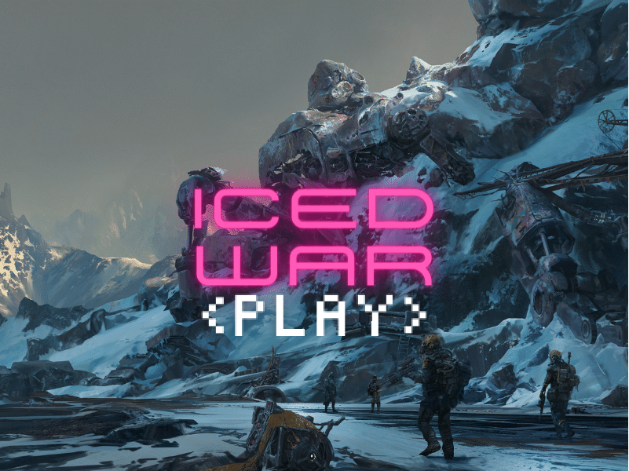
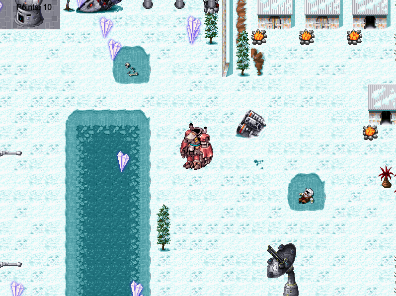
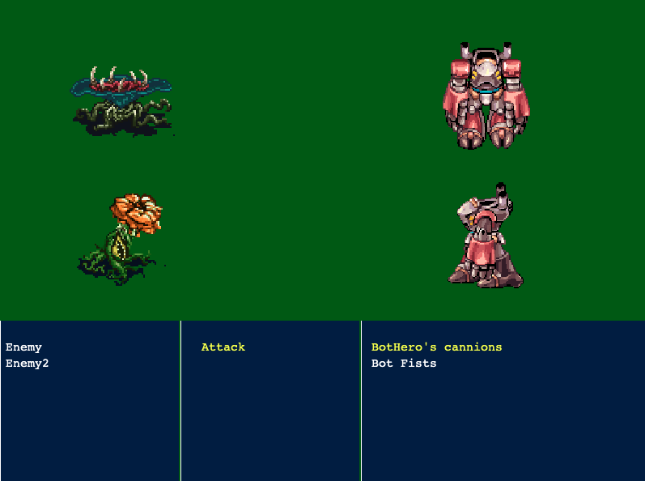
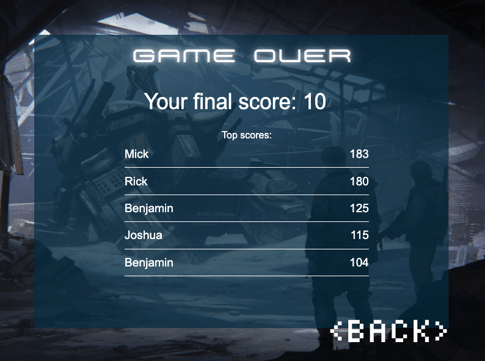

# Iced War

> RPG turn based game

  

  

  

  

This project is the Javascript capstone for Microverse.

This game is a turn-based RPG in which your objective is to rescue your teammates. To do it, you will be inside a robot vehicle. Trying to face those creatures without it would be suicide.

Collecting supplies will not only give you more power, but it will also give you a better score. Get to your teammates to win the game. Hint: they are on the other side of the map.

 

## Live Demo

[Live Demo Link](https://alejandrono4.github.io/JS-capstone/)

 

## Game Design Document

More information about the game in the [GDD](./GDD.md)

 

## Getting Started

To get a local copy up and running, follow these simple example steps.

- At first, you have to clone this repository. Open your terminal and paste this without the $ sign.

      $ git clone https://github.com/AlejandroNo4/JS-capstone.git

- Now that you have the repository in your local machine. Change the direction of the local file with your terminal. Just type "$ cd" (without the $ sign) and the path to reach the JS-capstone folder. 
  Something like:

        $ cd User/Documents/JS-capstone

- Now, to install Webpack, run in your terminal:

        $ npm install webpack webpack-cli --save-dev

- You are done with the installations! Now to run the project, first type:

        $ code .

- This must open Vs code. For now, keep it open. Go back to your terminal and now run: 

        $ npm run build

- Now, back on Vs Code, open the "dist" folder. Then right-click on the index.html file and click on open with Live Server.

 

## Run Tests

- To run tests, you have to install Jest. Please run:

        $ npm install --save-dev jest

- Now, type:

        $ npm run test

 

## Built With

- Javascript
- VS Code
- Git
- HTML
- CSS

## Author

👤 **Author1**

- GitHub: [@AlejandroNo4](https://github.com/AlejandroNo4)
- Twitter: [@Alejand80002666](https://twitter.com/Alejand80002666)
- LinkedIn: [Alejandro Contreras Rodriguez](https://www.linkedin.com/in/alejandro-contreras-rodriguez-b524821b5)

## 🤝 Contributing

Contributions, issues, and feature requests are welcome!

Feel free to check the [Issues page](https://github.com/AlejandroNo4/JS-capstone/issues).

## Show your support

Give a ⭐️ if you like this project!

## Acknowledgments

- Title Background [zhu liu](https://www.artstation.com/migaloo)

- Secondary background [Hakob Minasian](https://www.artstation.com/hakobminasian)

- Robot [Ragnarocker](https://www.spriters-resource.com/pc_computer/ragnarokonline/sheet/141307/)

- Music by [Retimer](https://opengameart.org/content/wgs-music-27-war-loops), [yd](https://opengameart.org/content/war-on-water-tracks) and [nene](https://opengameart.org/content/boss-battle-6-8-bit) 

- Sound efects [jalastram](https://opengameart.org/content/sound-effects-sfx010)

- Tiles by [kydogan](https://www.spriters-resource.com/pc_computer/yodastories/sheet/28276/)

- Enemies by [Davias](https://www.spriters-resource.com/mobile/legendofmonsterhunter/sheet/43702/) 

## 📝 License

This project is [MIT](./MIT.md) licensed.